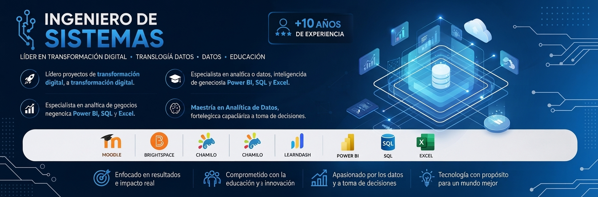

## Hola soy Edgar Orjuela 👋

  

  
  

---

### 👨‍💻 Sobre mí
Ingeniero de Sistemas y Especialista en Entornos Virtuales de Aprendizaje con **más de 10 años de experiencia** liderando proyectos de transformación digital, administración de plataformas LMS y gestión tecnológica para instituciones educativas, organismos internacionales y entidades públicas. Actualmente, curso una Maestría en Analítica de Datos para potenciar la toma de decisiones estratégicas a través de la información.

---

### 🚀 Experiencia Destacada

* **🎓 Universidad El Bosque** — *Asistente de Proyectos (2023 - Actualidad).
  * Coordinación tecnológica de programas de Educación Continua, administración de LMS y aseguramiento de calidad.
* **🌐 Organización Internacional del Trabajo (OIT)** — *Líder de Datos (2024)*.
  * Administración de plataformas virtuales, elaboración de indicadores y gestión de analítica de datos.
* **🏢 Fundación Face IT** — *Líder de Proyectos TI (2015 - 2025)*.
  * Dirección tecnológica de proyectos de formación virtual, tableros en Power BI y coordinación de equipos de soporte.

---

### 🛠️ Competencias Técnicas

| Área | Tecnologías / Habilidades |
| :--- | :--- |
| **LMS & E-Learning** | `Moodle` `Brightspace` `Chamilo` `LearnDash` `SCORM`. |
| **Analítica & Datos** | `Power BI` `SQL` `Excel Avanzado` `Looker Studio` `Python` `R`. |
| **Gestión & Marcos** | `Scrum` `ITIL` `Gestión de Proyectos` `QA` `Indicadores`. |
| **Infraestructura** | `Microsoft 365` `Google Workspace`. |

---

### 🏆 Certificaciones Destacadas
* 🛡️ **Scrum Master**.
* 🤖 **Microsoft IA e Innovación**.
* 🍎 **Google Educator Nivel 1**.
* ⚙️ **Administración Moodle & ITIL Foundation**.

 ---
### 📊 Mis estadísticas en GitHub

  

  

---

  
  

